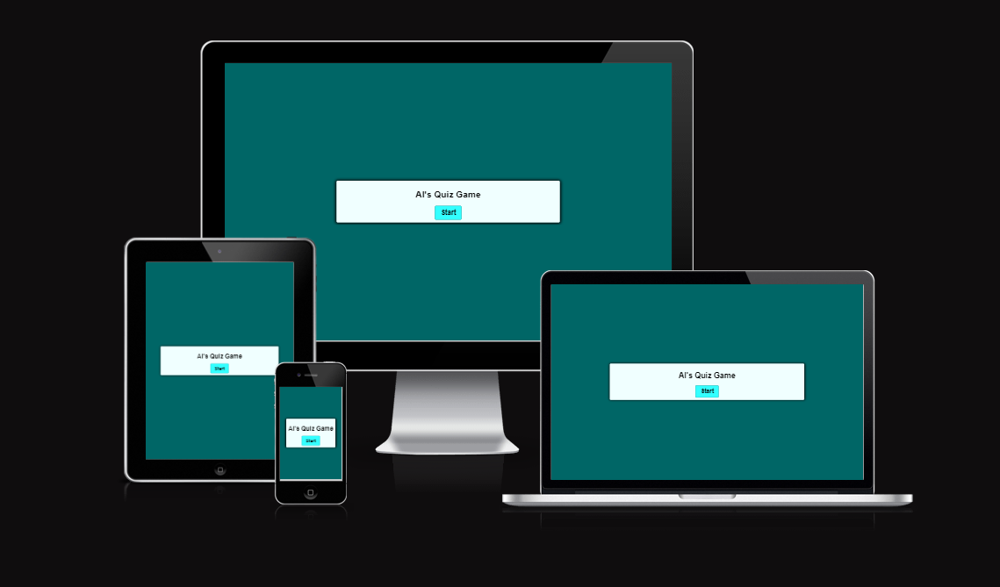
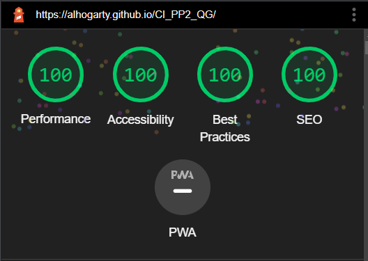

# Al's Quiz Game

Al's Quiz Game is a general knowledge quiz that anyone can play. 

Live Demo - [Here](https://alhogarty.github.io/CI_PP2_QG/)

Github Repository - [Here](https://github.com/AlHogarty/CI_PP2_QG)

## Table of Contents

* [Features](#features)
  * [Existing Features](#existing-features)
  * [Features to Implement](#features-to-implement)
* [Technologies Used](#technologies-used)
* [Testing](#testing)
* [Deployment](#deployment)
* [Credits](#credits)

## Features

### Existing Features

- Start Button
- Next Button
- 12 Questions
- 4 Multiple Choice Answers for each Question
- Restart Button
- Background color and answer buttons changes to red for wrong answer and green for correct answer

### Features to Implement

- Score Tracker
- Progress Bar
- End Game Result Page

## Technologies Used

- HTML5
- CSS3
- JavaScript
- Github
- Gitpod

## Testing

- HTML

   [W3C Validator](https://validator.w3.org/nu/?doc=https%3A%2F%2Falhogarty.github.io%2FCI_PP2_QG%2F)

   No errors were found

- CSS

  [Jigsaw Validator](https://jigsaw.w3.org/css-validator/validator?uri=https%3A%2F%2Falhogarty.github.io%2FCI_PP2_QG%2F&profile=css3svg&usermedium=all&warning=1&vextwarning=&lang=en)

  No errors were found

- JavaScript

  [Jshint Validator](https://jshint.com/)

  No errors were found

  There are 11 functions in this file.

  Function with the largest signature take 2 arguments, while the median is 1.

  Largest function has 8 statements in it, while the median is 2.

  The most complex function has a cyclomatic complexity value of 2 while the median is 1.

- Google Lighthouse

  

## Deployment

- The site was deployed to GitHub pages. The steps to deploy are as follows:
  
    - In the GitHub repository, navigate to the Settings tab
    - From the source section drop-down-menu, select the Master Branch
    - Once the master branch has been selected, the page provided the link to the completed website

## Credits

- Code Institute Course Material and Slack Community

- [StackOverflow](https://stackoverflow.com/) forum

- Original code taken from [WebDevSimplified](https://www.youtube.com/c/WebDevSimplified) JavaScript Quiz Tutorial

- Quiz Questions taken from [QuizQuestions.net](https://www.quiz-questions.net/)